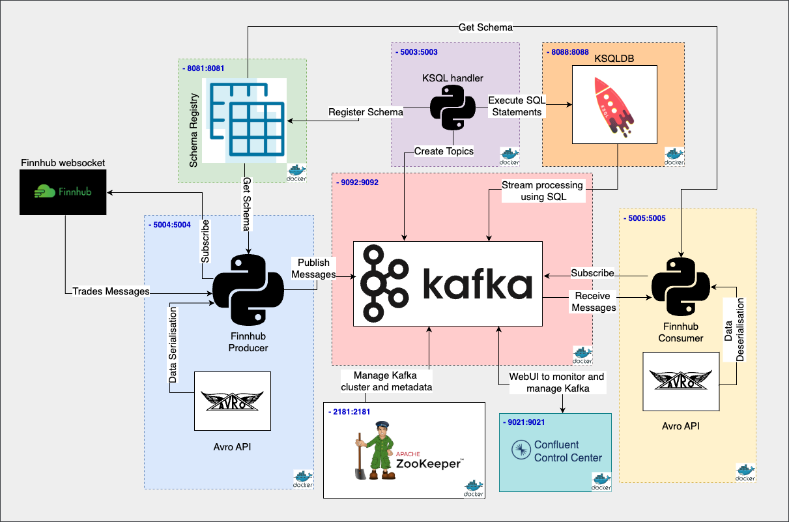

# Finnhub Data Pipeline with Kafka and ksqlDB

This project implements a data pipeline that ingests financial data from the Finnhub API, processes it using ksqlDB, and makes it available for consumption.  It leverages Docker Compose for easy setup and management of the required services.

## Architecture


## Overview

The pipeline consists of the following components:
* **Kafka Core Components**
    * **Kafka Broker:**  Handles message queuing and distribution.
    * **Zookeeper:** Provides coordination and service discovery for Kafka.
    * **Schema Registry:** Manages Avro schemas for data serialization.
    * **ksqlDB Server:** Performs stream processing and transformations on the data using SQL-like queries.
* **Application Services**
    * **ksql Handler:** A custom service for managing schema creation and topics, ksqlDB queries and stream definitions.
    * **Finnhub Producer:** Fetches data from the Finnhub API and publishes it to a Kafka topic.
    * **Finnhub Consumer:** Consumes data from Kafka topics.
* **Kafka Monitoring Components**
    * **ksqlDB CLI:** Command-line interface for interacting with ksqlDB.
    * **Control Center (Optional):** Provides a UI for monitoring and managing Kafka.
    * **Kafka REST Proxy (Optional):** Exposes a RESTful interface to interact with Kafka.

## Getting Started

### Prerequisites

* Docker and Docker Compose installed.
* A Finnhub API key.

### Installation
1.  Clone the repository:
    ```bash
    git clone https://github.com/MalmikeFunProjects/FinnhubDataPipeline.git
    cd FinnhubDataPipeline
    ```
2.  Create a `.env` file in the root directory and add your Finnhub API key:

    ```
    FINNHUB_API_KEY=your_finnhub_api_key_here
    ```
    This file is automatically loaded by docker-compose.
3.  Update the *sample.env* files in each service to match your environment.

### Running the Pipeline

1. **Run the Docker Compose setup:** <br>
    The provided run_docker_compose.sh script simplifies starting and stopping services.
    ```sh
    ./run_docker_compose.sh -h  # Display help information
    ```

    **Key Usage:**
    - `-r <run_services>`: Starts specified services.
        - `all_services`: Start all services.
        - `required_services`: Start Kafka core and application services.
        - `kafka_core`: Start Zookeeper, Broker, Schema Registry, and ksqlDB Server.
        - `kafka_monitoring`: Start Control Center, Kafka REST, and ksqlDB CLI.
        - `application_services`: Start ksql Handler, Finnhub Producer, and Finnhub Consumer.
    - `-s <stop_services>`: Stops specified services.
        - `all_services`: Stop all services.
        - `kafka_monitoring`: Stop Control Center and Kafka REST.
        - `application_services`: Stop ksql Handler, Finnhub Producer, and Finnhub Consumer.
    - `-b`: Builds the Docker images before starting the containers. Use this when you've made changes to the Dockerfiles or application code.
    - `-v`: Enables verbose output.
    NB:

    **Examples:**
    - Start all services and build the images:
        ```sh
        ./run_docker_compose.sh -r all_services -b
        ```
    - Start only the required services:
        ```sh
        ./run_docker_compose.sh -r required_services
        ```
    - Stop all services:
        ```sh
        ./run_docker_compose.sh -s all_services
        ```

    **Points to Note about Service Dependencies**

    * **Application Service Dependencies:** The services grouped under `application_services` (ksql Handler, Finnhub Producer, and Finnhub Consumer) depend on the core Kafka services (`kafka_core` - Zookeeper, Broker, Schema Registry, ksqlDB Server).

    * **Automatic Dependency Resolution:**  When you start `application_services`, *docker compose* automatically starts the necessary `kafka_core` services.  You do *not* need to start them separately. This is handled by the `depends_on` directives in the `docker-compose.yml` file.

    * **Rebuilding Specific Services:** The `-b` (build) flag only rebuilds the Docker images of the services specified with the `-r` flag.  This is important to remember when you've made code changes:
        * `./run_docker_compose.sh -r application_services -b`: This command will rebuild *only* the `application_services` images and then start all required services (including the already-built `kafka_core` services).  The `kafka_core` services will *not* be rebuilt unless you specifically include them with the `-r` flag, e.g., `./run_docker_compose.sh -r all_services -b`.
        * `./run_docker_compose.sh -r kafka_core -b`: This will rebuild only Kafka core images.

    * **Stopping Services:**  The `-s` (stop) flag behaves similarly.  It only stops the services specified.
        * `./run_docker_compose.sh -s application_services`: This will stop only the `application_services`. The `kafka_core` services will continue to run unless you stop them explicitly.
        * `./run_docker_compose.sh -s all_services`: This will stop all the services.

2. **(Optional) Verify which services are running:**
   ```sh
   docker ps
   ```

### Usage
*   **Finnhub Producer:** The `finnhub-producer` service will start fetching data from the Finnhub API and sending it to Kafka. You can view the status of the fetched data with in the docker logs using `docker logs -f finnhub-producer`.
*   **Finnhub Consumer:** The `finnhub-consumer` service will consume and process the data from Kafka. You can view the status of the fetched data with in the docker logs using `docker logs -f finnhub-consumer`.
*   **ksqlDB:**  You can use the `ksqldb-cli` container to interact with ksqlDB and define your stream processing logic.  Connect to the `ksqldb-cli` container using:

    ```bash
    docker exec -it ksqldb-cli bash

    # Inside the container:
    ksql http://ksqldb-server:8088
    ```
*   **Control Center:** Access the Control Center web UI at `http://localhost:9021`.
*   **Kafka REST Proxy:**  Interact with Kafka through the REST API at `http://localhost:8082`.

### Volumes
Data persistence for Zookeeper is handled using Docker volumes:
- `zookeeper_data`: Stores Zookeeper data.
- `zookeeper_log`: Stores Zookeeper logs.

## Troubleshooting
- If you encounter issues, check the logs of the respective containers using `docker-compose logs <service_name>`.
- Ensure that your Finnhub API key is correctly set as an environment variable.
- If you make changes to the application code, rebuild the Docker images using the `-b` flag with the run command.

## Further Development
This setup provides a foundation for building a more complex data pipeline. You can extend it by:
- Adding more data sources.
- Implementing more sophisticated data transformations with ksqlDB.
- Integrating with other data processing and visualization tools.

